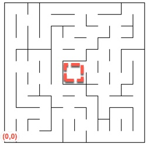
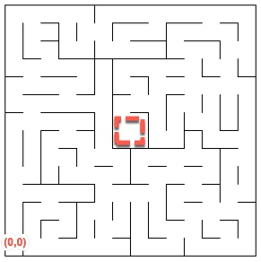

# Machine Learning Engineer Nanodegree
## Capstone Proposal
Michael Green August 29, 2017

## Proposal

<!--
_(approx. 2-3 pages)_
-->

### Domain Background

<!--

_(approx. 1-2 paragraphs)_

> In this section, provide brief details on the background information of
the domain from which the project is proposed. Historical information
relevant to the project should be included. It should be clear how or
why a problem in the domain can or should be solved. Related academic
research should be appropriately cited in this section, including why
that research is relevant. Additionally, a discussion of your personal
motivation for investigating a particular problem in the domain is
encouraged but not required.
-->

The project involves writing the learning system to enable a virtual robot to automatically
traverse several mazes.

The [Micromouse](https://en.wikipedia.org/wiki/Micromouse) is an event that began in the  
1970's and has since become a worldwide event attracting roboticists and and robots enthusiast from all parts of the world.

Also there has been ongoing research into robot automation and in particular automatic 
maze traversal using various underlying algorithms.[^1][^2][^3]

[^1]: Osmankovic, D & Konjicija, Samim. (2011). Implementation of Q - Learning algorithm for solving maze problem.. 1619-1622. 
[^2]: Ahamed Munna, Tanvir. (2013). Maze solving Algorithm for line following robot and derivation of linear path distance from nonlinear path. .
[^3]: Rakshit, Pratyusha & Konar, Amit & Bhowmik, Pavel & Goswami, Indrani & Das, Sanjoy & C. Jain, Lakhmi & Nagar, Atulya. (2013). Realization of an Adaptive Memetic Algorithm Using Differential Evolution and Q-Learning: A Case Study in Multirobot Path Planning. Systems, Man, and Cybernetics: Systems, IEEE Transactions on. 43. 814-831. 10.1109/TSMCA.2012.2226024. 

This past research is relevant because it offers proven techniques that serve as the
useful body of work regarding how machine learning has helped to produce solutions
to tough robot automation problems that have applications from consumer electronics, to 
medicine, to safety and security. For example, the underlying technology described here 
can be applied to urban rescue robots such as what is described in [^5]

[^5]: Davids, Angela. (2002). Urban Search and Rescue Robots: From Tragedy to Technology.. IEEE Intelligent Systems. 17. 81-83. 10.1109/5254.999224. 

#### Why This Problem Should Be Addressed 

As the concepts of robot automation embody themselves in an ever greater variety of
applications, there is a need to explore various alternative solutions to this particular
problem.

#### My Personal Motivation

From a personal perspective, I believe that machine learning based robot automation
has applications in other fields. I believe that working on this will give me deeper
insight into how machine learning can be applied to this problem that will help me to apply
this solution to new and challenging problems I may encounter in the future. 

### Problem Statement

<!--
_(approx. 1 paragraph)_

> In this section, clearly describe the problem that is to be solved. The
problem described should be well defined and should have at least one
relevant potential solution. Additionally, describe the problem
thoroughly such that it is clear that the problem is quantifiable (the
problem can be expressed in mathematical or logical terms) , measurable
(the problem can be measured by some metric and clearly observed), and
replicable (the problem can be reproduced and occurs more than once).

-->

Simply put, the problem is to develop the "brain" of a robot that takes as input only
the number of free squares to its left, front, and right sides given to it by three
sensors, and automatically traverse a maze to any one of the maze's four goal squares. 

The robot will always begin at location (0,0) (shown in red in the diagrams in [Datasets]) facing 
upwards (`self.heading=='up'`). The other constraint on the problem is that the robot is 
only allowed to make the following movements once per time step:

* It can rotate either -90, 0, or  90 degrees
* It can move no more than 3 squares

The robot successfully traverses the maze when it has entered anyone of the four squares
in the center of the maze. These will be called the _goal squares_ (shown below in red in
the diagrams in [Datasets]) in this proposal.

There is an overall time step limitation: The robot gets a total of 1000 time steps
to traverse the maze. As is described in [Metrics], it will perform two runs that
must total no greater than 1000 time steps.

### Datasets and Inputs [Datasets]

<!-- 

_(approx. 2-3 paragraphs)_ 

In this section, the dataset(s) and/or input(s) being considered for the
project should be thoroughly described, such as how they relate to the
problem and why they should be used. Information such as how the dataset
or input is (was) obtained, and the characteristics of the dataset or
input, should be included with relevant references and citations as
necessary It should be clear how the dataset(s) or input(s) will be used
in the project and whether their use is appropriate given the context of
the problem. 
-->

The dataset for this problem is composed of the three mazes depicted below.

As you can see there are three mazes that must be traversed. The overall shape of 
each maze is a perfect square. The dimensions for the first maze are 12x12, for the second
maze are 14x14, and the third maze are 16x16.

### Solution Statement

<!--
_(approx. 1 paragraph)_

> In this section, clearly describe a solution to the problem. The
solution should be applicable to the project domain and appropriate for
the dataset(s) or input(s) given. Additionally, describe the solution
thoroughly such that it is clear that the solution is quantifiable (the
solution can be expressed in mathematical or logical terms) , measurable
(the solution can be measured by some metric and clearly observed), and
replicable (the solution can be reproduced and occurs more than once).
-->

The "brain" of the robot will be a re-enforcement learning (RL) based system
that implements the Q-learning algorithm. It will be based on a 
state space that is large enough to thoroughly cover all possible situations
the robot may be in as it traverses the maze without including too many state
variables that would explode the state space, which makes it harder for RL based machine
to learn the maze.

### Benchmark Model [BenchmarkModel]

<!--
_(approximately 1-2 paragraphs)_

> In this section, provide the details for a benchmark model or result
that relates to the domain, problem statement, and intended solution.
Ideally, the benchmark model or result contextualizes existing methods
or known information in the domain and problem given, which could then
be objectively compared to the solution. Describe how the benchmark
model or result is measurable (can be measured by some metric and
clearly observed) with thorough detail.
-->

The benchmark model used in this project will be that of a robot that always randomly
makes movements on every time step. I will compare the score achieved by the RL-based robot
to the score of a robot that always moves based on random decisions.

### Evaluation Metrics [Metrics]

<!--
_(approx. 1-2 paragraphs)_
In this section, propose at least one evaluation metric that can be used
to quantify the performance of both the benchmark model and the solution
model. The evaluation metric(s) you propose should be appropriate given
the context of the data, the problem statement, and the intended
solution. Describe how the evaluation metric(s) are derived and provide
an example of their mathematical representations (if applicable).
Complex evaluation metrics should be clearly defined and quantifiable
(can be expressed in mathematical or logical terms).
-->

The scoring scheme is as follows:

The robot will be scored based on two runs, where in each run the robot starts at square (0,0) with heading "up":

* In run #1, the score is is the number of time steps it took the robot to explore the maze and eventually move into a goal square divided by 30. Run #1 ends when the robot has reached a goal square.
* In run #2, the score is the number of time steps it took the robot to reach the goal square.

Once it has reached a goal square in run #2, the overall score will be the summation of the score from #1 and run #2.

For example if the robot took 600 steps in run #1 to reach a goal square, and then took
400 steps to reach the goal in run #2, then the overall score would be:

    Overall Score = 1/30 * 600 + 400 = 420

### Project Design
<!--
_(approx. 1 page)_

In this final section, summarize a theoretical workflow for approaching
a solution given the problem. Provide thorough discussion for what
strategies you may consider employing, what analysis of the data might
be required before being used, or which algorithms will be considered
for your implementation. The workflow and discussion that you provide
should align with the qualities of the previous sections. Additionally,
you are encouraged to include small visualizations, pseudocode, or
diagrams to aid in describing the project design, but it is not
required. The discussion should clearly outline your intended workflow
of the capstone project.
-->

The workflow for this approaching the solution will involve:

* Running the benchmark model and comparing its scores to the final RL-based model
* Choosing a state space for the robot's Q-learning system
* Choosing a reward calculation methodology that results in a populated state space that based on the Q-learning algorithm drives the robot to a goal square as quickly as possible
* Determine adequate hyper parameters for the Q-learning system 
* Setup a training program to adequately train the robot's RL system
* Develop enough diagnostic information to be able to debug issues with the robot while it is training or running the scored test.

Hyper parameters will be determined by running a few experiments with epsilon, and different exploration rate equations

<!--

**Before submitting your proposal, ask yourself. . .**

- Does the proposal you have written follow a well-organized structure
similar to that of the project template? - Is each section (particularly
**Solution Statement** and **Project Design**) written in a clear,
concise and specific fashion? Are there any ambiguous terms or phrases
that need clarification? - Would the intended audience of your project
be able to understand your proposal? - Have you properly proofread your
proposal to assure there are minimal grammatical and spelling mistakes?
- Are all the resources used for this project correctly cited and
referenced?

-->