# Machine Learning Engineer Nanodegree
## Capstone Project: Robot Motion Planning
Michael Green  
September 17, 2017


## I. Definition [Definition]

<!--
_(approx. 1-2 pages)_
-->

### Project Overview

<!--

In this section, look to provide a high-level overview of the project in layman’s terms. Questions to ask yourself when writing this section:
- _Has an overview of the project been provided, such as the problem domain, project origin, and related datasets or input data?_
- _Has enough background information been given so that an uninformed reader would understand the problem domain and following problem statement?_

-->

The project involves developing the learning system to enable a virtual robot to automatically traverse several mazes.

The project is a form of the [Micromouse](https://en.wikipedia.org/wiki/Micromouse) is an event that began in the   1970's and has since become a worldwide event attracting roboticists and and robots enthusiast from all parts of the world.

Also there has been ongoing research into robot automation and in particular automatic maze traversal using various underlying algorithms.[^1][^2][^3]

[^1]: Osmankovic, D & Konjicija, Samim. (2011). Implementation of Q - Learning algorithm for solving maze problem. 1619-1622. 
[^2]: Ahamed Munna, Tanvir. (2013). Maze solving Algorithm for line following robot and derivation of linear path distance from nonlinear path. .
[^3]: Rakshit, Pratyusha & Konar, Amit & Bhowmik, Pavel & Goswami, Indrani & Das, Sanjoy & C. Jain, Lakhmi & Nagar, Atulya. (2013). Realization of an Adaptive Memetic Algorithm Using Differential Evolution and Q-Learning: A Case Study in Multirobot Path Planning. Systems, Man, and Cybernetics: Systems, IEEE Transactions on. 43. 814-831. 10.1109/TSMCA.2012.2226024. 


This past research is relevant because it offers proven techniques that serve as the useful body of work regarding how machine learning has helped to produce solutions to tough robot automation problems that have applications from consumer electronics, to  medicine, to safety and security. For example, the underlying technology described here  can be applied to urban rescue robots such as what is described in [^5]

[^5]: Davids, Angela. (2002). Urban Search and Rescue Robots: From Tragedy to Technology.. IEEE Intelligent Systems. 17. 81-83. 10.1109/5254.999224. 

As the concepts of robot automation embody themselves in an ever greater variety of applications, there is a need to explore various alternative solutions to this particular problem. This project describes how Q-learning can be applied to develop a robot that can traverse a maze automatically with a reasonable amount of training.


<!--
In major subsection [Definition] this project describes and provides a solution to the problem of how to get a robot to automatically traverse a maze of arbitrary size under certain constraints. The project will describe via the [ProblemStatement] the maze and the constraints under which the robot moves through the maze. The project will then describe how the effectiveness of any given solution to the maze traversal problem is measured in [Metrics].

In major subsection [Analysis], the project will analyze the maps, which are the input data to this problem in [DataExploration]. The project will provide visualizations to robot solutions and how they compare to the best solution in [Visualizations]. The underlying algorithm that drives the robot's movements throughout the maze in its objective to reach a goal square are described in [Algorithms]. The project compares the chosen algorithm to the benmark algorithm  in [Benchmark].

In major subsection [Methodology], the project will describe what (if any) pre-processing is done to the input data in [Preprocessing]. The project will describe the details of how the algorithm was implemented in [Implementation]. The project will describe what steps where made to improve the robot's maze traversal in [Refinement]. 

In major subsection [Results], the project will provide an evaluation of the model in [ModelEvaluation]. The project will compare the benchmark model to the chosen model and use this comparison as justification for the chosen model in [Justification].

In major subsection [Conclusion] the project will delve into some details of the chosen model and how they are indicators of the overall quality of the model. In [Reflection] the project will describe some aspects of the project that were of peculiar concern or any difficulties encountered while developing this work. And finally in [Improvement] the project will take an aspect of the project that could be improved.
-->

### Problem Statement [ProblemStatement]
<!--
In this section, you will want to clearly define the problem that you are trying to solve, including the strategy (outline of tasks) you will use to achieve the desired solution. You should also thoroughly discuss what the intended solution will be for this problem. Questions to ask yourself when writing this section:
- _Is the problem statement clearly defined? Will the reader understand what you are expecting to solve?_
- _Have you thoroughly discussed how you will attempt to solve the problem?_
- _Is an anticipated solution clearly defined? Will the reader understand what results you are looking for?_
-->

Simply put, the problem is to develop the "brain" of a robot that takes as input only the number of free squares to its left, front, and right sides given to it by three sensors, and automatically traverse a maze to any one of the maze's four goal squares, which are the four squares in the center of the maze. 

The robot will always begin at location (0,0) (shown in red in the diagrams in [DataExploration]) facing upwards (`self.heading=='up'`). The other constraint on the problem is that the robot is only allowed to make the following movements once per time step:

* It can rotate either -90, 0, or  90 degrees
* It can move no more than 3 squares

The robot successfully traverses the maze when it has entered anyone of the four squares in the center of the maze. These will be called the goal squares (shown below in red in the diagrams in [DataExploration]).

There is an overall time step limitation: The robot gets a total of 1000 time steps to traverse the maze. As is described in [Metrics], it will perform two runs that must total no greater than 1000 time steps.

The problem will be approached by first studying the mazes that will have to be traversed. Then multiple robot models will be developed and tested to see how well each traverses the maze. Visualizations (using python turtle graphics) of the attempts the robot makes to traverse the maze will be studied to determine improvements required to the robot's mechanism for learning and traversing mazes. These steps (develop a model, test the model on a maze, evaluate the model via visualization, and refine the model) will be performed iteratively until all of the mazes can be solved using a Q-learning model that can be trained with a reasonable amount of compute resources. In each step, various aspects of the robot's implementation will be analyzed and updated to improve the robot in subsequent iterations.


### Metrics [Metrics]
<!--
In this section, you will need to clearly define the metrics or calculations you will use to measure performance of a model or result in your project. These calculations and metrics should be justified based on the characteristics of the problem and problem domain. Questions to ask yourself when writing this section:
- _Are the metrics you’ve chosen to measure the performance of your models clearly discussed and defined?_
- _Have you provided reasonable justification for the metrics chosen based on the problem and solution?_
-->

The scoring scheme is as follows:

The robot will be scored based on two runs, where in each run the robot starts at square (0,0) with heading "up":

* In run #1, the score is the number of time steps it took the robot to explore the maze and eventually move into a goal square divided by 30. Run #1 ends when the robot has reached a goal square.
* In run #2, the score is the number of time steps it took the robot to reach the goal square.

Once it has reached a goal square in run #2, the overall score will be the summation of the score from #1 and run #2.

For example if the robot took 600 steps in run #1 to reach a goal square, and then took
400 steps to reach the goal in run #2, then the overall score would be:

    Overall Score = 1/30 * 600 + 400 = 420


This metric is mandated by the initial project definition as outlined [here]. The metric is considered to be reasonable because it discounts the steps required in the first run which is the run the robot uses to explore the maze and emphasizes the efficiency of the robot's second run which should be the run it makes based on whatever it was able to learn about the maze in its first run.

[here]: https://docs.google.com/document/d/1ZFCH6jS3A5At7_v5IUM5OpAXJYiutFuSIjTzV_E-vdE/pub

## II. Analysis [Analysis]
<!--
_(approx. 2-4 pages)_
-->

### Data Exploration [DataExploration]

<!--
In this section, you will be expected to analyze the data you are using for the problem. This data can either be in the form of a dataset (or datasets), input data (or input files), or even an environment. The type of data should be thoroughly described and, if possible, have basic statistics and information presented (such as discussion of input features or defining characteristics about the input or environment). Any abnormalities or interesting qualities about the data that may need to be addressed have been identified (such as features that need to be transformed or the possibility of outliers). Questions to ask yourself when writing this section:
- _If a dataset is present for this problem, have you thoroughly discussed certain features about the dataset? Has a data sample been provided to the reader?_
- _If a dataset is present for this problem, are statistics about the dataset calculated and reported? Have any relevant results from this calculation been discussed?_
- _If a dataset is **not** present for this problem, has discussion been made about the input space or input data for your problem?_
- _Are there any abnormalities or characteristics about the input space or dataset that need to be addressed? (categorical variables, missing values, outliers, etc.)_
-->

The dataset for this problem is composed of the three mazes depicted below.

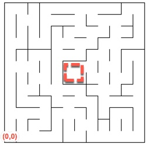
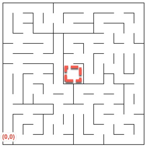
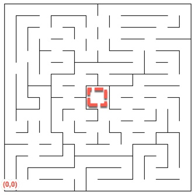

As you can see there are three mazes that must be traversed. The overall shape of  each maze is a perfect square. The dimensions for the first maze are 12x12, for the second maze are 14x14, and the third maze are 16x16.

The mazes are specified in three different text files `test_maze_01.txt`, `test_maze_02.txt`, and `test_maze_03.txt`. The maze is read in by the `test.py` script. The text file is decoded by `test.py` into a maze. All mazes are prefect squares, i.e. the number squares representing the length of the maze is always equal to the number of squares representing the height of the maze. The first line of the text file is a number that represents the length and width of the maze. Each subsequent line of the text file has a special encoding which describes which side of the square has a wall. Each number should be interpreted as a 4 bit binary number. If any given bit is a 0, it means that square has a wall on one if the square's sides, and if it's a 1 means there is no wall on that particular side of the square. Which side has or doesn't have a wall depends on the value of the bit position for a given number as follows:

* bit 0 determines whether a wall is present on the up-facing side of the square
* bit 1 determines whether a wall is present on the right-facing side of the square
* bit 2 determines whether a wall is present on the bottom-facing side of the square
* bit 3 determines whether a wall is present on the left-facing side of the square

Each line of the text file will be a comma separated list of N numbers where N is the width of the maze, and each number encodes the presence or absence of wall on a given side per the encoding described above. There will N lines of these comma separated list of numbers, where N is the height of the maze.

Here as a example is text file for `test_maze_01.txt`:
```
12
1,5,7,5,5,5,7,5,7,5,5,6
3,5,14,3,7,5,15,4,9,5,7,12
11,6,10,10,9,7,13,6,3,5,13,4
10,9,13,12,3,13,5,12,9,5,7,6
9,5,6,3,15,5,5,7,7,4,10,10
3,5,15,14,10,3,6,10,11,6,10,10
9,7,12,11,12,9,14,9,14,11,13,14
3,13,5,12,2,3,13,6,9,14,3,14
11,4,1,7,15,13,7,13,6,9,14,10
11,5,6,10,9,7,13,5,15,7,14,8
11,5,12,10,2,9,5,6,10,8,9,6
9,5,5,13,13,5,5,12,9,5,5,12
```

Here is the corresponding maze rendered graphically by `showmaze.py` with the starting position and goal squares highlighted.


### Exploratory Visualization [Visualizations]
<!--
In this section, you will need to provide some form of visualization that summarizes or extracts a relevant characteristic or feature about the data. The visualization should adequately support the data being used. Discuss why this visualization was chosen and how it is relevant. Questions to ask yourself when writing this section:
- _Have you visualized a relevant characteristic or feature about the dataset or input data?_
- _Is the visualization thoroughly analyzed and discussed?_
- _If a plot is provided, are the axes, title, and datum clearly defined?_
-->

There are several interesting properties of these mazes that needed to be taken into account when devising a effective algorithm to enable the robot to traverse the mazes.

* _Maze size_: Larger mazes may take longer to traverse than smaller mazes
* _Number of dead ends_: The number of dead ends (marked in maze 3 by the red circles in the diagram below) may result in the robot taking longer to traverse a maze and there may be multiple approaches/heuristics that may have to be implemented in the robot's traversal algorithm to effectively identify and move out of dead ends.
* _Number of loops_: The number and size of loops (some in maze 3 with the green lines in the diagram below) in a maze can also result in the robot taking longer than usual to traverse a maze as the robot could possibly think that because it's moving at every time step that it is making progress towards a goal square when in fact it's just traveling in a loop. Again the algorithm must be tuned to learn about loops and move out of them.

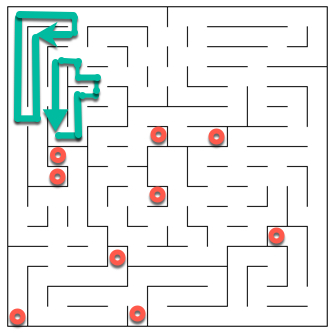

### Algorithms and Techniques [Algorithms]

<!--
In this section, you will need to discuss the algorithms and techniques you intend to use for solving the problem. You should justify the use of each one based on the characteristics of the problem and the problem domain. Questions to ask yourself when writing this section:
- _Are the algorithms you will use, including any default variables/parameters in the project clearly defined?_
- _Are the techniques to be used thoroughly discussed and justified?_
- _Is it made clear how the input data or datasets will be handled by the algorithms and techniques chosen?_
-->


The algorithm that drives the robot's decision making for traversing the maze is a modified Q-learning algorithm. The difference between the modified Q-learning algorithm and the algorithm used by the robot is that the robot has a canned behavior for moving out of dead ends that is not driven from state-action-value information accumulated via the iterative action, reward process that characterizes Q-learning. 

#### Q-Learning Description

Q-learning is an algorithm that is a kind reinforcement learning, where an agent can determine a set of actions to take to achieve via an iterative calculation that converges to a set of actions that when performed results in the agent reaching its goal.

The basic model in which the robot (the agent) operates and performs Q-learning is shown in the diagram below:

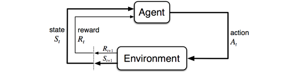

As part of the Q-learning process, the agent, which for this project is the robot, will perform some action (A~t), where the possible actions are described in [ProblemStatement]. After performing its action, the environment will deliver a new state and a reward. 

The state at any given time t (s~t) is defined for this project as a combination of the robot's maze coordinates (location of the robot within the maze) and robot orientation. For example the initial state of the robot is defined as `(0,0) u` which means the robot is at location (0,0) in the maze and is facing up.

The agent (robot) will calculate an action-value for taking a specific action a~t in state s~t for a given time t using the equation below:

\\( Q(s_t,a_t) \gets  Q(s_t,a_t) + \alpha * (r(s_t,a_t) + \gamma * max_a Q(s_t+1, a) - Q(s_t,a_t) )\\)

Where the following terms are defined:

* \\( Q(s_t,a_t) \\) : The value of taking action a at time t (a~t) in state s at time t (s~t)
* \\( r(s_t,a_t) \\) : The immediate reward for taking action a at time t (a~t) in state s at time t (s~t)
* \\(  \gamma \\)  : Discount rate for the action-value of future actions
* \\( \alpha \\) : Learning rate which determines how much should current action values be impacted by updated calucations for new actions
* \\( max_a Q(s_t+1, a)  \\) : The largest possible action value at time t+1 for all possible actions a that can be taken in state s~t+1

Please note that \\( \gets \\) means that \\( Q(s_t,a_t) \\) is being updated after every action a~t. 

Since the environment (the maze) does not change over time, future rewards factor into Q(s,a) update calculations, hence \\( \gamma \\) is not zero.

The Q-learning algorithm converges to a collection of preferred actions (actions that for a given state have the largest action-value for all possible states) that will reach its goal based on the following factors:

* Based on the set of rewards for all possible actions
* How much time the robot/agent spends performing actions based only on the current Q(s,a) or on a random action

For this project, the robot is rewarded as follows:

* If the robot performs an action that results in it entering a goal square it receives a reward of 10
* If the robot performs an action where it does not move, it receives a reward of -10
* If the robot performs an action that results in it moving (changing position) it will receive a reward that is an inverse function of its average distance from its new location to the goal squares

The robot will at any time t randomly decide to  perform an action strictly based on some constrained random action based on probability \\( \epsilon \\) which is calculated over time using this equation:

\\( \epsilon = \left| \cos(0.03 * t) \right| \\)

Otherwise it will perform an action based on \\( Q(s_t,a_t) \\). The parameter \\( \epsilon \\) is also known as the exploration/exploitation factor. The action the robot takes is constrained random (not purely random) because the robot will never move backwards (have negative movement) though the environment does allow the robot to move in reverse. This was done to simplify next-state calcuation and reward calcuation. Also it was found that when the robot's benmark behavior which includes being allowed to move backwards did not help the robot achieve its goal faster than not allowing it to move backwards. 

#### Heuristic For Maneuvering Deadends

Regardless of the value of \\( \epsilon \\) the robot will always perform a series of maneuvers when it reaches a dead end state. A dead end state is defined as any state where the sensor input is (0, 0, 0). In this particular case the robot will perform a specific set of movements over in the two time steps following the point in time it first detects a sensor reading of (0, 0, 0). The movements are as follows:

* In the first time step after encountering a dead end it will always rotate 90 degrees and move 0 spaces
* In the second time step after encountering a dead end it will always rotate 90 degrees and move 0 spaces

It will then after these two time steps proceed to act per the Q-learning algorithm using \\( \epsilon \\) as the probability determinator for the type of next action (Q-based or constrained random). The robot does update its Q(s,a) for these deadend states but never uses these values.

<!-- Should I discuss alternatives with respect to deadend avoidance?-->

### Benchmark [Benchmark]
<!--
In this section, you will need to provide a clearly defined benchmark result or threshold for comparing across performances obtained by your solution. The reasoning behind the benchmark (in the case where it is not an established result) should be discussed. Questions to ask yourself when writing this section:
- _Has some result or value been provided that acts as a benchmark for measuring performance?_
- _Is it clear how this result or value was obtained (whether by data or by hypothesis)?_
-->

The benchmark model used in this project will be that of a robot that always randomly makes movements on every time step. I will compare the score achieved by the Q-learning based robot to the score of a robot that always moves based on random decisions.


## III. Methodology [Methodology]
<!--
_(approx. 3-5 pages)_
-->

### Data Preprocessing [Preprocessing]

<!--
In this section, all of your preprocessing steps will need to be clearly documented, if any were necessary. From the previous section, any of the abnormalities or characteristics that you identified about the dataset will be addressed and corrected here. Questions to ask yourself when writing this section:
- _If the algorithms chosen require preprocessing steps like feature selection or feature transformations, have they been properly documented?_
- _Based on the **Data Exploration** section, if there were abnormalities or characteristics that needed to be addressed, have they been properly corrected?_
- _If no preprocessing is needed, has it been made clear why?_
-->

Even though the robot takes only sensory input from the environment it uses this input data to derive other inputs that are used in the Q-learning operation of the robot. The real input data to the robot from the environment is just a sensor input expressed as a list of integers which represents the number of free spaces to the left, front, and right facing sides of the robot. Hence `[1,2,3]` means that there is 1 open space one the left, 2 open spaces to the front, and 3 open spaces one the right side of the robot.

It derives *heading*--which direction is the robot facing--that is a function of the starting state of the robot and its subsequent actions. It is used to determine its new location as a consequence of a set of actions at any point in time or location within the maze.

It derives from sensory data and the fact that its initial location is always (0,0) a *location* within the maze in the form of (x,y) coordinates and then uses it as part of the state of the robot at any given time and uses it as part of calculating its reward. 

The *reward* is a preprocessed input of the input sensor data as the reward is a function of the robot's average distance from a goal square and whether or not the coordinates of its current location is different from its location in the previous time step.

### Implementation [Implementation]

<!--
In this section, the process for which metrics, algorithms, and techniques that you implemented for the given data will need to be clearly documented. It should be abundantly clear how the implementation was carried out, and discussion should be made regarding any complications that occurred during this process. Questions to ask yourself when writing this section:
- _Is it made clear how the algorithms and techniques were implemented with the given datasets or input data?_
- _Were there any complications with the original metrics or techniques that required changing prior to acquiring a solution?_
- _Was there any part of the coding process (e.g., writing complicated functions) that should be documented?_
-->

The robot's maze traversal behavior was implemented as a Q-learning algorithm. As such the robot first runs in an environment implemented in `trainer.py` to learn the maze. The robot then runs in an environment implemented by `tester.py` which runs the robot and scores it final traversal. The two runs are completely separate from each other and are actually two different python script command invocations. The learning accumulated in the run with the `trainer.py` environment is written out to a PKL file which is then subsequently read in for the `tester.py` run.

The diagram below shows at a high level how the robot operation is implemented when it is operating to achieve a score:

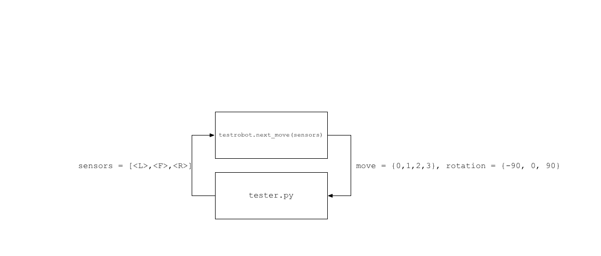

The robot (the agent) waits for input in the form of a list called `sensors`. The environment (embodied in `tester.py`) passes that to the robot via a call to `testrobot.next_move()`. The robot then processes the sensor input along with other flags settings (detailed below) to determine its next move, predict its new location, calculate the reward for that move, and update the internal Q-learning state. It then sends the determined motion in the form of a (rotation, movement) tuple back to the environment (`tester.py`) which will process this output from the robot to determine it's new location in the maze and then calculate and send to it a new `sensor` input to be processed in the next time step.

Below is a diagram that details the internal operation of `Robot::next_move()`:


`VALID_ROTATIONS` is just a list of the possible valid rotation values that the robot can select, which is {-90,0, 90}.

`constrained_random_action()` is a function that is called when the robot wants to choose at random a movement and rotation. The function picks a rotation that results in the robot moving in the direction where it can make the most moves. If there are multiple rotations, then it will randomly pick among them. It will then move in that direction with a number of movements randomly selected between 0 and 3. `constrained_random_action()`  also detects when the robot has entered a dead end and has a small state machine that will move the robot out of the dead end.

`get_best_actions()` selects a rotation and movement based on the best action-value found using Q-learning for the given state (`location`,`heading`) of the robot in the current `timestep`.

`calc_new_location()` will take the `sensors` input, `chosen_rotation`, `chosen_movement`, the current `location` and `heading` and predict the new location for the robot after it has executed its `chosen_rotation` and `chosen_movement`.

`calc_new_heading()` will predict the new direction that the robot will point after executing it's `chosen_rotation`.

`update_robot()` is the function that takes `sensors`, `current_location`, `current_heading`, `new_location`, `new_heading`, and the robot's `chosen_movement`, and `chose_rotation` and calculates the reward for it chosen set of actions, and based on it's state (`current_loation`,`current_heading`) updates the internal Q-learning (state,action-value) table.

The diagram below shows at a high level how the robot operation is implemented when it is creating a plan to solve the maze via Q-learning:

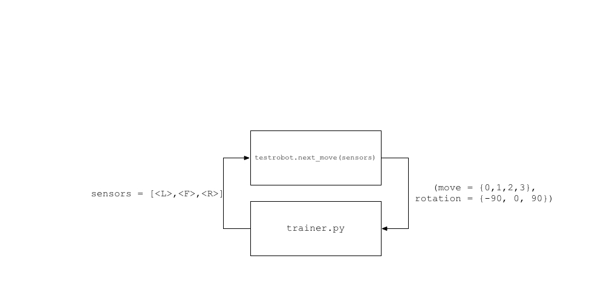

The difference between `trainer.py` and `tester.py` is that the `max_time` and `number_of_runs` are set to values to enable the robot to explore the statespace of the Q-learning implementation. At the end of the trainer run, the Q-table (state->action-value mappings) is written out to a file called `robot_Qtable.p`.

It will not chose a negative movement, and the `constrained_random_action()` function is used to detect when the robot has entered a dead end.

#### Challenges Faced Implementing The Q-Learning Robot
These were some of the largest challenges faced while executing this project:

* Defining the state for the Q-table of the robot
* Defining the reward function for the Robot
* Determining the type of random actions to allow and to not allow the robot to perform
* How to reuse training in the scored runs.

It was a challenge to define the state of the robot. A state is required because the Q-learning algorithm requires that the agent record action-values for all possible actions for each given state the agent can take on within a given environment. It's know from working on previous projects that if a state-type is not chosen correctly it may either result in a state-space that requires too much training in order to adequately cover it or may result in a state-space that does not comprehensively describe all the possible situations the agent may encounter in the environment. The bottom line consequence of either situation is that the robot would not be able to solve mazes at all even when using very large training trials.

At first the the chose state for the robot was just its location in the maze using an (x,y) coordinate system with the origin at the start point in the maze. It was originally thought that this would result in a very small state space (essentially the state space is \\( N^2 \\) where \\( N \\) is the dimension of the maze). After some large training trials (1000's of training trials) it was found that the robot could not successfully traverse certain mazes. It was then realized that the best action a robot should take not only is dependent upon its location in the maze, but _also in which direction the robot was heading in that given position_. This results in a larger state space (now it's \\( 4*N^2 \\)). But this was a tractable increase in size: meaning the amount of extra training was reasonable (it was not an exponential increase in state space). In return for the increased state space, the new state definition resulted in a Q-table that more accurately incorporated action-values in a Q-table that once adequately trained resulted in the robot being able to traverse all of the mazes.

The second challenge involved determining a good reward system. It is understood that the reward function for the Q-learning robot was vital to the behavior of the robot. Due to underlying complexities of the maze (the presence of several dead ends and loops) a simple reward system that rewarded a single negative value for all types of movements and large positive value for movements into a goal square proved counterproductive to achieving a final behavior that solved the maze. After observing robot behaviors it was realized that:

* Actions that result in zero movement should be discouraged
* Actions that move away from the goal squares should be discouraged, but in a gradual manner so to not drive the robot into dead ends that happen to be close to a goal square

Consequently a more complex reward function was devised where the robot would receive large negative rewards for running into walls, and would receive better rewards for actions that move it closer to the goal squares resulted in the robot converging during training to behaviors that solved all of the mazes.

The third challenge entailed determining how often the robot should behave randomly and what would be considered the allowed actions when it behaves randomly. After some trail-and-error it was realized that allowing it to do all of the actions defined in the problem statement would not be the best policy to take when allowing the robot to take random actions. It was found that moving backwards (especially when moving backwards out of a dead end) made it more difficult for the robot to act efficiently on the actions subsequent to its backwards movement. So a new set of movements and rotations  were setup in the robot when it acts randomly that did not include it moving backwards. 

The fourth challenge centered around how to implement the robot to enable transfer the training accumulated during the robot's training trials to the final scored runs. It was determined that writing out the trained Q-table at the end of its training trials and reading it in before starting its scored runs was a simple and low-cost way to do that.

### Refinement [Refinement]

<!--
In this section, you will need to discuss the process of improvement you made upon the algorithms and techniques you used in your implementation. For example, adjusting parameters for certain models to acquire improved solutions would fall under the refinement category. Your initial and final solutions should be reported, as well as any significant intermediate results as necessary. Questions to ask yourself when writing this section:
- _Has an initial solution been found and clearly reported?_
- _Is the process of improvement clearly documented, such as what techniques were used?_
- _Are intermediate and final solutions clearly reported as the process is improved?_
-->

There were several refinements made during the implementation of the robot. 

The first refinement revolved around the decision to allow or not allow the robot to move backwards. At first it was contemplated that it would be the fastest (and hence highest scoring) means by which to move out of dead ends. But two things where discovered:

* The robot will have to make a move after backing out of the dead end. Using `constrained_random_action()` would most likely result in it moving back into the dead end
* The sensor input would increase the chance of the robot making a high-reward movement if the robot were facing away from the dead end.
* It was difficult to predict the location of the robot after it moved in a negative direction. The robot knowing its location of the robot was key to a correct reward calculation which was essential to the Q-learning algorithm converging to a good solution.

So the robot's behavior was implemented such that it will never move backwards. Instead a dead end detection logic and dead end maneuvering state machine were implemented to enable the robot to move out of a dead end in at least two time steps.

The second refinement involved how to reward the robot. At first the robot was given the same reward for all movements except the movement that resulted in the robot entering a goal square. The Q-table (table of states-to-action-value mappings) resulted in most actions having equal value. The robot tended to not reach any goal square during the scored runs, and it did not improve with an increase in training runs with `trainer.py`.

A second reward scheme was selected that involved giving a small positive reward if the robot changed position as a consequence of its action, giving the same large positive score if it entered a goal square, and giving a small negative score otherwise. The result of this reward scheme was that movements that resulted in changes in the robot position but that moved the robot *farther* away from the goal squares had higher scores that movements that moved the robot closer to the goal squares. It did not result in any improvement in goal achievement. 

Finally a reward scheme was selected that rewarded the robot very negatively for any actions that did not result in movement, a small positive reward was given that scaled up inversely to the robot's average resultant distance from the goal squares. As a consequence, the robot learned solutions to mazes in a reasonable training time and increasing training time enabled the robot to converge to very good solutions. The Q-table showed that actions that did not result in movement would almost never be chosen, and that there was more often than not a single best action for any given state the robot could be in for any of the three mazes.

Another refinement was in the selection of EPLISON calculation. It was determined that even during the `tester.py` run that the robot would most likely solve the maze if it was allowed to periodically perform a `constrained_random_action()`. Hence instead of a steadily decaying EPLSILON the following equation was implemented:

\\( \epsilon = | \cos(0.03 * t) | \\)

Where t is the time step.

Learning rate \\( \alpha \\) was selected to balance how much the reward from the current action should change learning. The discount rate for future action-values \\( \gamma \\) is a non-zero value as the maze does not change over time and hence the action value for actions in the next time step should factor into learning for the current time step.

## IV. Results [Results]

<!--
_(approx. 2-3 pages)_

-->


### Model Evaluation and Validation [ModelEvaluation]

<!--

In this section, the final model and any supporting qualities should be evaluated in detail. It should be clear how the final model was derived and why this model was chosen. In addition, some type of analysis should be used to validate the robustness of this model and its solution, such as manipulating the input data or environment to see how the model’s solution is affected (this is called sensitivity analysis). Questions to ask yourself when writing this section:
- _Is the final model reasonable and aligning with solution expectations? Are the final parameters of the model appropriate?_
- _Has the final model been tested with various inputs to evaluate whether the model generalizes well to unseen data?_
- _Is the model robust enough for the problem? Do small perturbations (changes) in training data or the input space greatly affect the results?_
- _Can results found from the model be trusted?_

* evaluate the model
* how was the model derived
* why was the model chosen
* validate its robustness  via analysis. 
-->


Q-learning was selected because it is an algorithm that is applicable to problems like the maze traversal problem. It has been used in training robot motion problems in various applications. The Q-learning robot is able to find solutions to all of the mazes after some training. This is because the robot will act randomly according to the epsilon equation during its first and second runs and hence does not always follow its Q-table. This enabled the robot to continue to explore the maze which resulted in the robot finding shorter paths to the goal squares in its second run than its first run in some cases. As will be described in [Visualization], the robot's second run is often different than its first run because of the continued explorative behavior during the first and second run.

The parameters (gamma, alpha, epsilon, and the choice of state) where reasonable. Gamma was set to 0.9 to provide some value to future actions given that the maze does not change over time and hence the value of future actions are meaningful. Alpha (learning rate) was set to 0.5 to enable exploration to influence learning without skewing learning due to poor randomly selected actions. The choice of state was useful. The chosen state enabled an adequate description of the state space of the robot in the maze without becoming too large and hence negatively impacting the effectiveness of training.

The Q-learning robot was tested with all three mazes (`test_maze_01.txt`, `test_maze_02.txt`, and `test_maze_03.txt`). In all cases the robot was able to find solutions with the same amount of pre-training. The robot is also able to generalize. After creating a fourth maze (`test_maze_04.txt`) it was able to find a solution. The scores and comparison to the benchmark model is detailed in [Justification]. Solutions will be depicted in [Visualization].

The model was derived from the Q-learning algorithm. It was modified by adding a heuristic that enables the robot to always quickly identify and move out of dead ends while at the same time enabling it to do an effective move subsequent to exiting a dead end. The robot's motion was modified to enable it to predict its location in the maze even with randomly selected actions, which was the basis of the robot's reward system. The reward equation was essential to getting the robot to converge onto a solution to all mazes. 

The overall robustness of the robot was not absolute. Meaning, that the robot cannot be guaranteed to solve a given maze 100% of the time for any given scored run. As described in [Justification], the robot only finds solutions to mazes a certain percent of the time. It has the ability to find a maze for all mazes described in this project, and as will be shown can find solutions to mazes most of the time for certain mazes. But due to the fact that the Q-learning algorithm and the robots implemented behavior includes some random actions, there is the chance that for any given maze that it has solved on run `X`, that it will fail to solve that same maze on run `X+1`.

### Justification [Justification]
<!--
In this section, your model’s final solution and its results should be compared to the benchmark you established earlier in the project using some type of statistical analysis. You should also justify whether these results and the solution are significant enough to have solved the problem posed in the project. Questions to ask yourself when writing this section:
- _Are the final results found stronger than the benchmark result reported earlier?_
- _Have you thoroughly analyzed and discussed the final solution?_
- _Is the final solution significant enough to have solved the problem?_
-->
The Q-learning robot is compared to a robot driven by a purely random maze traversal algorithm. In all three mazes, the Q-learning robot was able to find a goal square in the allotted 1000 time step limit. The random traversal robot was only able to find a goal square for mazes 01 and 02 after running 10000 trials. In contrast the Q-learning robot scores were collected from a set of 100 trials after the robot had been trained in the `trainer.py` environment.

The table below shows the best scores achieved by the Q-learning robot compared to the best score achieved by the random robot.

Maze|Q-learning Robot Score|Random Robot Score
----|----------------------|-------------------
01  | 47.867               | 173.967
02  | 99.40                | Score not achieved in 10000 trials
03  | 107.633              | 472.867
[Best Scores Rate Q-Learning and Random Robots]

Below shows the rate at which the Q-learning robot found a solution to the maze (in 100 trials) to the rate at which the random robot found a solution to the maze (in 10000 trials).

Maze|Percent of Q-learning trials that ended in a Score|Percent of Random trials that ended in a score
----|--------------------------------------------------|-----------------------------------------------
01  | 74%                  | 0.4%
02  | 40%                  | No solution found in 10000 trials
03  | 86%                  | 0.1%
[Solution Rate for Q-Learning and Random Robots]

I also tested to make sure the Q-learning robot could generalize to an arbitrary maze. Below is a table of the best score achieved by the Q-learning robot (100 trials) for maze 04 compared to the best score achieved by the random robot (5000 trials):

Maze|Q-learning Robot Score|Random Robot Score
----|----------------------|-------------------
04  | 43.233               | 634.800
[Maze 04 Best Scores Rate Q-Learning and Random Robots]

The Q-learning robot found a solution to `test_maze_04.txt` 99% of the time (out of 100 trials) whereas the random robot found a solution 0.02% of the time (out of 5000 trials).


## V. Conclusion [Conclusion]
<!--
_(approx. 1-2 pages)_
-->
### Free-Form Visualization [Visualization]

<!--
In this section, you will need to provide some form of visualization that emphasizes an important quality about the project. It is much more free-form, but should reasonably support a significant result or characteristic about the problem that you want to discuss. Questions to ask yourself when writing this section:
- _Have you visualized a relevant or important quality about the problem, dataset, input data, or results?_
- _Is the visualization thoroughly analyzed and discussed?_
- _If a plot is provided, are the axes, title, and datum clearly defined?_
-->

Below are visualizations of the Q-learning robot's solutions to `test_maze_01.txt`, `test_maze_02.txt`, `test_maze_03.txt`, and `test_maze_04.txt`. The red line depicts the movements the robot took in the first run, and the purple line shows the path the robot took in the second run.

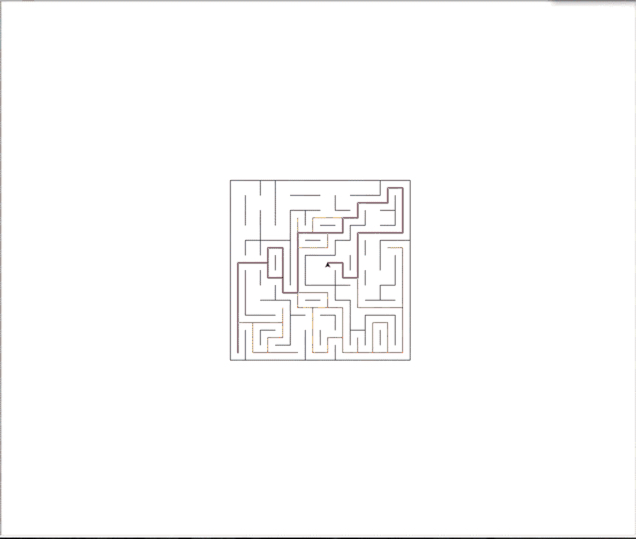

You can refer to [maze01] for the motion GIF visualization.

[maze01]: https://github.com/michael-a-green/machine-learning/blob/master/projects/capstone/maze_01_solution.gif "Maze 01 Solution"
[maze02]: https://github.com/michael-a-green/machine-learning/blob/master/projects/capstone/maze_02_solution.gif "Maze 02 Solution"
[maze03]: https://github.com/michael-a-green/machine-learning/blob/master/projects/capstone/maze_03_solution.gif "Maze 03 Solution"
[maze04]: https://github.com/michael-a-green/machine-learning/blob/master/projects/capstone/maze_04_solution.gif "Maze 03 Solution"

The score for the maze 01 solution is 47.867.

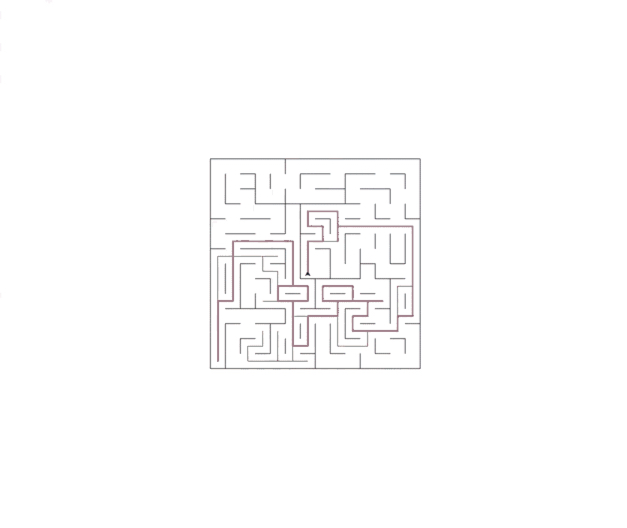

You can refer to [maze02] for the motion GIF visualization.

The score for the maze 02 solution is 99.400.

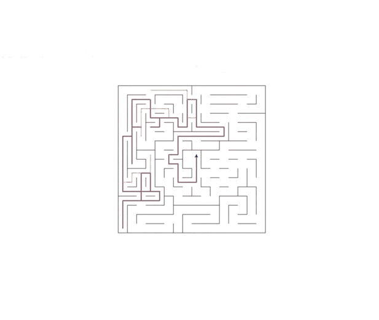

You can refer to [maze03] for the motion GIF visualization.

The score for the maze 03 solution is 107.633

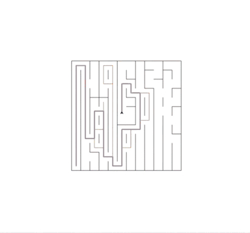


You can refer to [maze04] for the motion GIF visualization.

The score for the maze 04 solution is 43.233.

### Reflection [Reflection]

<!--
In this section, you will summarize the entire end-to-end problem solution and discuss one or two particular aspects of the project you found interesting or difficult. You are expected to reflect on the project as a whole to show that you have a firm understanding of the entire process employed in your work. Questions to ask yourself when writing this section:
- _Have you thoroughly summarized the entire process you used for this project?_
- _Were there any interesting aspects of the project?_
- _Were there any difficult aspects of the project?_
- _Does the final model and solution fit your expectations for the problem, and should it be used in a general setting to solve these types of problems?_
-->

I thought about which algorithm I will use. I considered the following:

* Use the `A*` algorithm
* Use Q-Learning
* Use pure random

I first tried a robot that behaved only randomly. After several attempts, I found that the robot was either not able to find solutions to the maze in a reasonable amount of time or not able to find a solution even after thousands of trials. 

I considered the `A*` algorithm. But I was not very familiar with the algorithm and wanted only to use something that I had studied previously so that I could provide a thorough analysis of the robot's behavior and how the algorithm affected the robot's behavior.

I then implemented an initial Q-learning robot. After several trials I found that it could find solutions in maze 01 and maze 03 but could never find a solution to maze 02. After visualizing these attempts, I realized that the robot the had following problems:

* It was not able to move out of dead ends
* It was not able to get passed loops

I solved the problem of getting trapped in dead ends by first adjusting the allowed behaviors of the robot in dead end states. I added a fixed state machine based behavior to enable the robot to detect and move out of dead ends 100% of the time regardless of the level of learning it had achieved at the point in time in which it entered the dead end.

I no longer allowed the robot to move backwards. I adjusted the reward mechanism as described in [Refinement] above. I also adjusted the epsilon equation for the robot to allow it to periodically explore the maze even as it traversed the maze in its second run. This resulted in the robot converging to a behavior where it would not spend all of its time in loops.

One difficult aspect of the problem was trying to detect behavioral problems in the robot actions. At first I just relied upon a text print out of robot coordinates to analyze robot behavior and identify any problems. But it became difficult in large mazes to synthesize this text information into addressable concrete issues. I then implemented `show_maze_robot_movements.py` to visualize the movement of the robot through the maze for the first and second runs. This enabled me to see how much time the robot spent in various parts of different mazes and identify the issues with dead end and loop traversal.

Another difficult aspect of the project involved figuring out how to train the robot and enable it to use that training in the actual scored runs. I solved the problem by generating a PKL file of the Q-table after running the robot on `trainer.py` and enabling the robot to read this Q-table in during its scored runs using `tester.py`.

The model works well. The amount of training required is tractable. I was able to train the robot to find a solutions to all of the mazes via training. The amount of time it took to train all four mazes was finished in a few minutes running on a laptop computer with no special setup or installation of new applications required.

### Improvement [Improvement]
<!--
In this section, you will need to provide discussion as to how one aspect of the implementation you designed could be improved. As an example, consider ways your implementation can be made more general, and what would need to be modified. You do not need to make this improvement, but the potential solutions resulting from these changes are considered and compared/contrasted to your current solution. Questions to ask yourself when writing this section:
- _Are there further improvements that could be made on the algorithms or techniques you used in this project?_
- _Were there algorithms or techniques you researched that you did not know how to implement, but would consider using if you knew how?_
- _If you used your final solution as the new benchmark, do you think an even better solution exists?_

-----------

**Before submitting, ask yourself. . .**

- Does the project report you’ve written follow a well-organized structure similar to that of the project template?
- Is each section (particularly **Analysis** and **Methodology**) written in a clear, concise and specific fashion? Are there any ambiguous terms or phrases that need clarification?
- Would the intended audience of your project be able to understand your analysis, methods, and results?
- Have you properly proof-read your project report to assure there are minimal grammatical and spelling mistakes?
- Are all the resources used for this project correctly cited and referenced?
- Is the code that implements your solution easily readable and properly commented?
- Does the code execute without error and produce results similar to those reported?
-->


The main improvement the implementation could make is accounting for errors in the actions of the robot. In other words if the robot were to choose the action (-90,3) but because of an error only perform the action (-90,2), how could it detect that this happened and make up for it? 

If this were a real physical robot, then it would also have to take into account many other factors. It would have to take into account speed, along with distance to a wall in order to prevent collisions with a wall that could potentially damage the robot. Also it may have to model more than just movements at right angles. It may want to incorporate movements at 45 degree angles which may be possible for a physical robot in a maze with large enough pathways.

